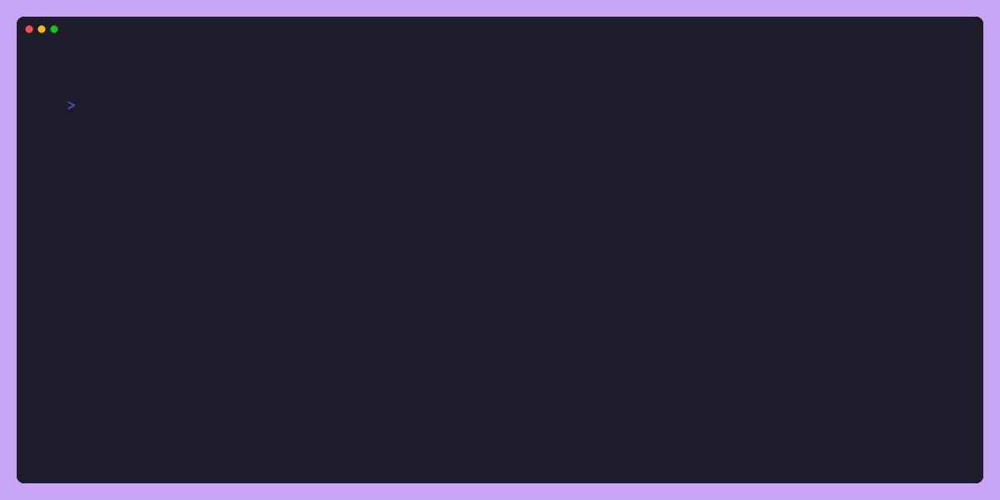

# ASKY - Plain & Simple TUI Prompt Library for Go



**asky** is a simple, minimal TUI prompt library for Go. It provides a set of pre-built prompts and helpers for common use cases, such as text inputs, password inputs, confirmation prompts, and more. The library is designed to be easy to use and extend, with a focus on simplicity and readability.

**asky** takes heavy inspiration from [Charm's libraries](https://www.charm.sh) and [pterm](https://www.pterm.sh), both of which have set the bar for making terminal UIs in Go delightful and expressive. Where Charm focuses on rich, composable interfaces and PTerm emphasizes structured yet elegant output, **asky** narrows its scope to keep prompts lightweight, straightforward, and easy to adopt—fitting seamlessly into everyday CLI workflows without unnecessary overhead.

While there are already great prompt libraries out there such as charm & pterm, they either aim for feature-completeness bringing a bit of heavy abstractions. asky exists to cover the middle ground: a lightweight library that gives you just the essentials—clear prompts, helpers, defaults, and theme support—without hidden complexity. It’s designed for developers who want prompts that just work in Go CLIs, without pulling in an entire TUI framework or wrestling with boilerplate.

**asky** is a work in progress and may undergo significant changes in the future.

## ✨ Features

- Simple, minimal API with sane defaults
- Interrupt-aware input (Ctrl+C handling)
- Theming support for prompts, helpers, and errors
- Ready-to-use defaults, easy to extend

## 📦 Installation

```sh
go get github.com/patppuccin/asky
```

🚀 Usage

```go
package main

import (
	"errors"
	"fmt"

	"github.com/patppuccin/asky"
)

func main() {
	// Text Input Example
	fname, err := asky.NewTextInput().
		WithPromptText("Please enter your first name").
		WithDefault("James").
		WithHelper("First name is the name that comes first").
		WithSeparator(": ").
		WithTheme(asky.ThemeDefault).
		Render()

	if err != nil {
		if errors.Is(err, asky.ErrInterrupted) {
			fmt.Println("Input Cancelled")
			return
		}
		fmt.Println("Error:", err)
		return
	}

	fmt.Println("First Name:", fname)
}
```

## 🎨 Theming

asky comes with a default theme but can be customized.
You can define your own theme for prompts, helpers, and errors.

Example:

```go
theme := asky.Theme{
	PrimaryStyle:   asky.Cyan,
	SecondaryStyle: asky.Magenta,
	HelperStyle:    asky.Dim,
	ErrorStyle:     asky.Red,
}
```

## 🛠 Roadmap

- Checkbox and multi-select prompts
- Password/secure inputs
- Progress indicators
- More theme presets

## 📜 License

MIT © 2025 patppuccin